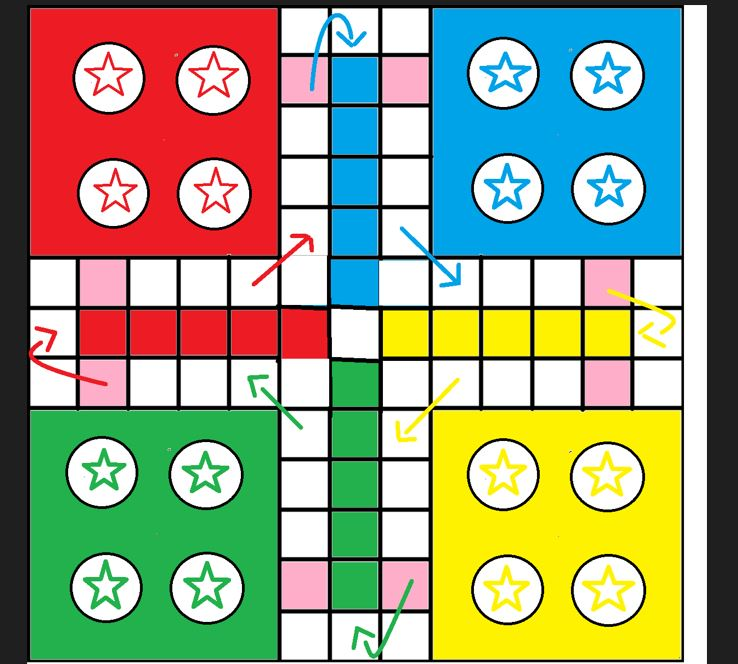

|   Name    |    Roll Num    |   Section |  
|   --------|    ------------|   --------|  
|Sajad Ali  |    22k-8729    | BAI-3C    |   
|Hasan Abdul Rehman|    22k-8727    | BAI-3C    |  
|M Hassan Nasar|    21k-4745    | BAI-3C    |  

## ***Game Information(Concept)***  

**We are designing the simple LUDO Game, there will be either two or four players who will play the game at once and there will be four pieces(Goti). Each player will be generated a random number and he will be moving his piece according to number. If A Person gets a (six 6) as random generated number he will be allowed to move his piece(Goti), else he will wait for six to come. When one piece of any player will move all the four sections of four players, he will have to move six additional steps to clear one piece. If player1 has a piece on a particular place and player2's piece came on same place then player2 will beat player1's piece and player1 again will have to have six(6) to move that beaten piece.**  

## ***Data Structures Utilization***  
**While developing a LUDO game, we should have focus on game board which is actually a grid, the grid where the players' pieces move and interact. The Data Structures Will Be Used Mostly An 2D-Array or a singly/doubly cricular linked lists(will be used according to situation). Arrays and lists which allow us to store information about position of players and pieces. Each cell in the grid can be an element in the array or list(Or we may use some other approach).**

## ***Objectives***
**Digital Transformation: 
Have converted the traditional Ludo board game into a digital format.**

**Multiplayer Support:
Have enabled interaction between up to four human players in a turn-based fashion.**

**Vector2f Representation: 
Have Implemented the game board using a Vector2f to represent different positions on the board.**

**User-Friendly Interface: 
Have Developed a user-friendly console-based interface for an enjoyable gaming experience.**

**Turn-Based Logic: 
Have Implemented turn-based gameplay, allowing each player to roll the dice and move their pieces.**

**Develop a Basic Turn-Based Ludo Game Prototype:
Create a prototype of a turn-based Ludo game featuring two players: one human and one computer-controlled.**

**Winning Conditions: 
Have defined winning conditions for players based on reaching the designated positions on the board.**

## ***Game Design Overview***  

 

* **In This Diagram The 4 Stars are 4 pieces(Goti) which player will be allowed to move after getting six(6) value, player will decide which piece he wants to move, each piece of each color will move (39 Steps and 5 additional steps to clear(pass) one piece).**

* **If my color is read then my piece will move 39 steps and will come at the red coloumn going inside, so these will be the five additional steps to pass.** 

## ***Phased Development***  

* **Base Classes Like piece,players etc** :
 In this phase, we will create the foundational classes and data structures for our Ludo game. These classes will represent the game pieces, players, and any other essential components. They will also define attributes and methods that are common across all game elements.
* **Graphics and User Interface** :
This step will include creating the game board, pieces (gotis), dice, and other visual elements. This will enhance the user experience while playing the game.
* **Game Setup**: 
This phase involves setting up the initial state of the game. We'll create the Ludo game board, position player tokens at their respective starting positions, and prepare the game for the first move.
* **Game Logic and Rules** :
In this step, we will implement the core game logic and rules of Ludo. This will include handling dice rolling, token movement, capturing opponents' tokens, entering the home column, moving through safe zones, and determining winning conditions. We will ensure that our game follows the international rules.
* **Testing and Debugging** :
In this step, we will thoroughly test our Ludo game. Furthermore, we will identify and fix any bugs or issues that arise. Moreover, we will conduct various test cases to validate the functionality and correctness of the game. In the end, we will ensure that our game runs according to the points mentioned in the proposal.
* **Networking(Optional)** :
This will be a valuable feature when two or more players are engaged in the game. It allows users to play from their own PCs instead of having to share one PC. Furthermore, it significantly enhances the user experience of playing LUDO.

## ***Challenges And Risks***  
**Ludo is not a simple game. It involves intricate rules and gameplay mechanics. Implementing and testing the game logic to ensure it adheres to the official Ludo rules can be a significant challenge. Ludo is traditionally a multiplayer game, so implementing multiplayer functionality, either locally or online, can be a complex and time-consuming task. Testing a game like Ludo thoroughly is crucial to identify and fix bugs, ensure fair gameplay, and provide a smooth user experience. Testing becomes more challenging as the game complexity increases.**

## ***Major Problems we faced during the project and how did we resolve them:***
**While making the Ludo game, we faced some big challenges. First, figuring out how the tokens move was tough. So, we made a specific path for each player's tokens. When it was a player's turn and their token left home, it moved based on the number rolled on the dice.**
**Next, dealing with tokens crashing into each other was also hard. We needed to decide which token moved first and which one followed, and if one token beat another, we had to send the beaten token back home. To solve this, we used two turns to keep track of the order of token movements.**
**Lastly, deciding who won the game was tricky. We agreed that when all four tokens of a player reached the end, that player would win. This rule helped determine the winner of the game.**

## ***Algorithm used to make the project :***

1.	Designing the Board:

•	We designed the board by filling the colours using the SFML built in “fill colour” function.

•	We drew the board on the screen using the SFML library to draw the board on the window.

2.	Token Movement Logic:

•	We designed a token movement system that controlled how tokens moved on the board based on dice values.

•	We assigned paths for each player's tokens and updated their positions accordingly when a player got a certain dice value.

3.	Dice Rolling Mechanism:

•	We implemented a dice rolling mechanism to generate random values.

•	We used the built-in random number generation function “srand” to simulate dice rolls.

4.	Collision Detection:

•	We developed collision detection logic to identify when two tokens landed on the same position.

•	We determined rules for what happened when a token landed on a position occupied by another token.

5.	Turn-Based System:

•	We implemented a turn-based system to control when each player could roll the dice and move their tokens.

•	We tracked whose turn it was and enabled actions accordingly.

6.	Winning Condition:

•	We established the winning condition where a player won when all four tokens of that player reached the destination.

•	We checked for this condition at the end of each player's turn.

7.	User Input Handling:

•	We implemented methods to handle user input (e.g., space bar clicks for rolling the dice and mouse clicks for selecting tokens to move).

8.	Application of rules:

•	We aimed to use as many rules as we could from the international Ludo rulebook.

## ***Time complexity:***
The overall time complexity of our game remained consistently constant, usually  **O(1)**. Fundamental game operations, such as token movement, collision handling, checking winning conditions, and managing turns, are independent of the game's size or the number of players. These operations deal with fixed-size data and processes that do not increase in relation to the game's scale, thereby ensuring a constant time complexity.

## ***Code Explanation Videos:***
**https://drive.google.com/drive/folders/1ZXXGKa7Cj3dRJsiWT5WgWMdtKAP5DsPt?usp=drive_link**

## ***How does our game run (video):***
**https://drive.google.com/drive/folders/1aiTXjDO_M3KsSyJViH34LpxpArLugFZ3?usp=drive_link**
